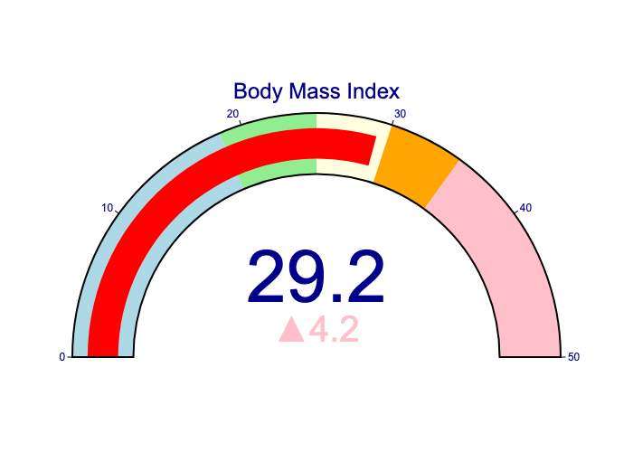
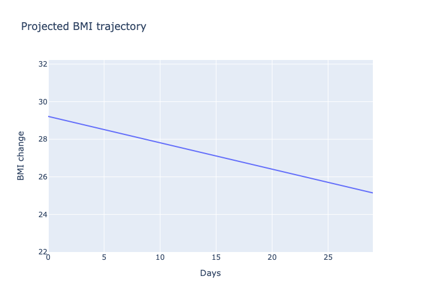
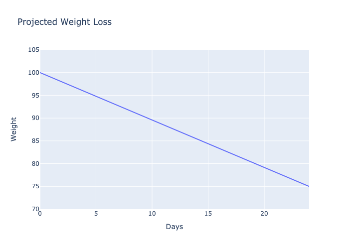
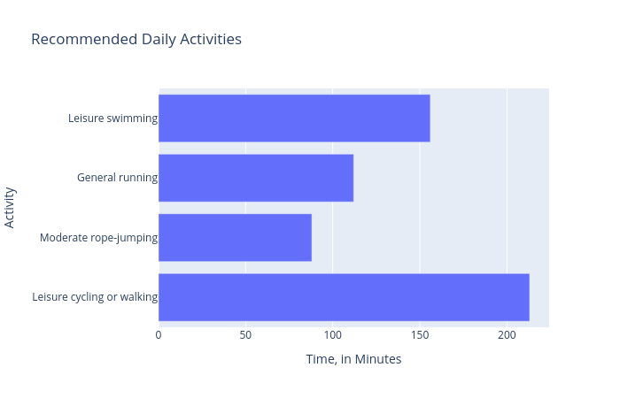

# bmigraph [](https://codecov.io/gh/UBC-MDS/bmi-calculator-python/tree/master) [](https://bmigraph.readthedocs.io/en/latest/?badge=latest)

> Authors: Qurat-ul-Ain Azim, Natalie Cho, HanChen Wang, Kelvin Wong
>
> Project complete in accordance with DSCI 524 for the UBC MDS Program 2022-23 for Group 12

This python package is for calculation of BMI (body mass index), and some more computations based on weight loss goals. The package provides simple answers to a user's weight loss goals in terms of how much weight loss/gain and calorie deficit/increase should be aimed for with a target weight and time frame in mind.  The package also provides helpful visualizations about BMI and calorie intake change trajectory leading to the target.

## Functions

The package contains the following functions

- `calculate_bmi`: computes user's BMI based on weight and height. Also creates a visual of the BMI on scale
- `project_bmi`: computes how much average change in BMI should be achieved per day given a targeted weight and the timeframe to reach the goal. Also presents a visual trajectory for BMI
- `project_calories`: computes how much average calorie intake is ideal per day given a targeted weight and the timeframe to reach the goal. Also presents a visual trajectory for calories
- `exercise_plan`: suggests possible exercise plans to achieve the targeted weight. Also gives a graph showing how much exercise of each kind is needed per day

## Suitability within Python Ecosystem

Our BMI calculator is unique in the sense that it provides easy and instantly understandable visuals to quickly get the gist of how healthy a person is. The package does not rely on any historical data of a person's weights, and hence needs no dataset files to be provided. The only arguments needed for the functions of this calculator are current weight and height, and target weight with timeframe in case weight change is desired. It also recommends simple figures for weight gain/loss goals. There are many BMI calculators in the Python ecosystem. Some of the examples can be found [here](https://pypi.org/project/body-mass-index/) and [here](https://pypi.org/project/Py-bmi/). Both these offer limited visual aid in understanding one's health metrics and targets related to BMI.


## Installation

```bash
$ pip install bmigraph
```

## Usage

To use the package, import the package with following command:

```
from bmigraph import calculate_bmi, exercise_plan, project_bmi, project_calories
```

To use the functions, see examples below:

### Calculate BMI
```
# Weight 100kg, height 1.85 meters, BMI value returned.
calculate_bmi(100, 1.85, return_graph=False)
# 29.218407596785973

# Weight 100kg, height 1.85 meters, BMI graph returned.
calculate_bmi(100, 1.85, return_graph=True)
```


### Compute average BMI change per week
```
# Weight 100kg, height 1.85 meters, BMI goal 25, 30 days to reach goal, return average BMI change per week. 
project_bmi(100, 1.85, 25, 30, return_graph=False)
# -0.98

# Weight 100kg, height 1.85 meters, BMI goal 25, 30 days to reach goal, return plot of Projected BMI trajectory. 
project_bmi(100, 1.85, 25, 30, return_graph=True)
```


### Compute caloric intake per day based in a target weight
```
# Weight 100kg, height 1.85 meters, male, 25 years old, moderate exercise 3-5 times a week, ideal weight 75kg, 
# 25 days to reach goal, return caloric intake per day based in a target weight. 
project_calories(100, 1.85, 1, 25, 1.6, 75, 25, return_graph=False)
# 2417.0400000000004

# Weight 100kg, height 1.85 meters, male, 25 years old, moderate exercise 3-5 times a week, ideal weight 75kg, 
# 25 days to reach goal, return plot of Projected Weight Loss. 
project_calories(100, 1.85, 1, 25, 1.6, 75, 25, return_graph=True)
```


### Create an exercise plan
```
# Weight 100kg, height 1.83 meters, female, aged 27
# Target weight: 68kg in 30 days
exercise_plan(100, 1.83, 2, 27, 68, 30)
# {'Leisure cycling or walking': 213,
# 'Moderate rope-jumping': 88,
# 'General running': 112,
# 'Leisure swimming': 156}

# Weight 100kg, height 1.83 meters, female, aged 27
# Target weight: 68kg in 30 days
# But this time, a graph instead:
exercise_plan(100, 1.83, 2, 27, 68, 30, return_graph=True)
```


## Contributing

Interested in contributing? Check out the contributing guidelines. Please note that this project is released with a [Code of Conduct](https://github.com/UBC-MDS/bmi-calculator-python/blob/master/CONDUCT.md). You can follow guidelines outlined [here](https://github.com/UBC-MDS/bmi-calculator-python/blob/master/CONTRIBUTING.md) in case you want to contribute to the project. By contributing to this project, you agree to abide by its terms.

The list of contributors to the original project can be found [here](https://github.com/UBC-MDS/bmi-calculator-python/blob/master/CONTRIBUTORS.md).

## License

`bmigraph` was created by Qurat-ul-Ain Azim, Natalie Cho, HanChen Wang, Kelvin Wong. It is licensed under the terms of the MIT license.

## Credits

`bmigraph` was created with [`cookiecutter`](https://cookiecutter.readthedocs.io/en/latest/) and the `py-pkgs-cookiecutter` [template](https://github.com/py-pkgs/py-pkgs-cookiecutter).
